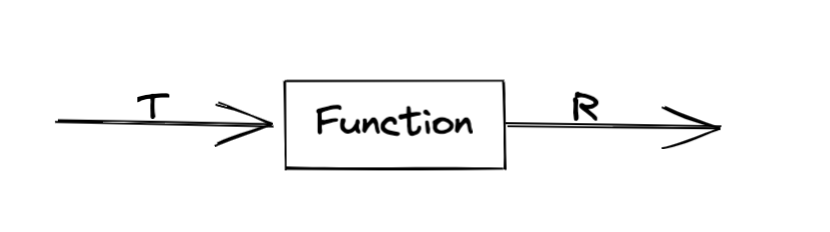

### 1.a



### 1.b

BinaryOperator. for example: Add or Minus.

### 1.c

x -> x + 1

### 2

```java
public class Question2 {
    public static void main(String[] args) {
        final ThreadLocal<DateFormatter> dateFormatterThreadLocal = ThreadLocal.withInitial(() -> new DateFormatter(new SimpleDateFormat("dd-MMM-yyyy")));
        System.out.println(dateFormatterThreadLocal.get().getFormat().format(new Date()));
    }
}
```